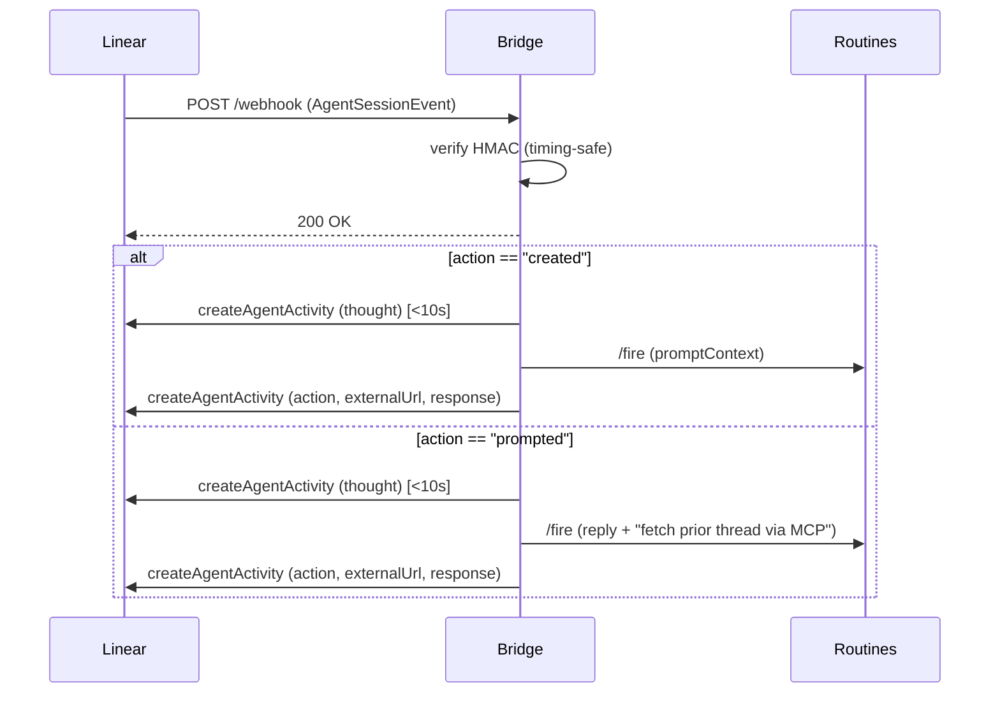

# linear-routines-bridge

A minimal webhook bridge that turns [Linear](https://linear.app) agent sessions into [Claude Code Routine](https://claude.ai/code/routines) fires, with agent-native rendering in the Linear session sidebar.

Assign an issue to the agent in Linear, and this bridge:

1. Receives Linear's `AgentSessionEvent`, verifies its HMAC signature.
2. Posts a `thought` activity in the Linear session sidebar within 10s (meeting Linear's ack window).
3. Fires a pre-configured Claude Code Routine with the issue context.
4. Posts an `action` activity with a clickable link to the Claude session, then closes the session with a `response` activity.
5. When the user replies in the session thread, fires a fresh Routine — the Routine's prompt is instructed to read prior Linear thread history via the Linear MCP connector for continuity.

## Architecture



The bridge is stateless apart from a single in-memory OAuth token. It does **not** poll Claude, track completion, persist sessions, or accumulate conversation state — that's by design. See [Limitations](#limitations).

## Setup

### 1. Register a Linear OAuth app

Go to [linear.app/settings/api/applications](https://linear.app/settings/api/applications) → **Create new**.

- **Actor:** `App user` (creates a dedicated agent user — do **not** pick "User")
- **Scopes:** `read`, `write`, `app:assignable`
- **Redirect URI:** `<BASE_URL>/oauth/callback`
- **Webhook URL:** `<BASE_URL>/webhook`
- **Webhook events:** check `Agent session events`

Copy the `Client ID`, `Client secret`, and `Webhook signing secret` — you'll need them in `.env`.

### 2. Create a Claude Routine

Go to [claude.ai/code/routines](https://claude.ai/code/routines) → create a Routine.

- Connect the target GitHub repo.
- Connect the Linear MCP (required for the agent to comment back on issues and for follow-ups to read prior thread state).
- In the Routine prompt template, tell the agent how to behave — something like:

  ```
  You were invoked from a Linear issue. The human is NOT watching your
  session in claude.ai — they only see what you post to Linear.

  1. Keep your own session output terse. It's scratch space, not user
     communication.
  2. All user-facing communication happens via Linear comments. Use the
     Linear MCP to post on the originating issue for progress updates,
     questions, and the final summary.
  3. Sign every comment "— Claude Code Agent" so readers can tell the
     comment came from the agent, not from the person who configured
     the MCP connector.
  4. On follow-up invocations, read the Linear issue's prior comments
     and agent session activities before responding — you do not
     retain memory across fires.
  ```

Copy the Routine's trigger ID (e.g., `trig_01UsCfTKkKeY9LqjfkhJpxK7`) and an Anthropic API key with Routines access.

### 3. Configure `.env`

```sh
cp .env.example .env
# Fill in the six required values: LINEAR_CLIENT_ID, LINEAR_CLIENT_SECRET,
# LINEAR_WEBHOOK_SECRET, CLAUDE_ROUTINE_ID, CLAUDE_ROUTINE_TOKEN, BASE_URL.
```

### 4. Install and run

```sh
npm install
npm run dev       # tsx watch src/index.ts
# or for production:
npm run build && npm start
```

### 5. Install the agent in Linear

Visit `<BASE_URL>/oauth/authorize` once. Approve the app in Linear. The server logs should show `Installed for workspace: <name>`.

Assign an issue to the agent user in Linear. You should see `thought` → `action` → `response` activities render in the session sidebar, and a clickable link to the Claude session.

## Environment variables

| Variable | Required | Purpose |
|----------|----------|---------|
| `LINEAR_CLIENT_ID` | yes | From the Linear OAuth app |
| `LINEAR_CLIENT_SECRET` | yes | From the Linear OAuth app |
| `LINEAR_WEBHOOK_SECRET` | yes | HMAC signing secret for the Linear webhook |
| `CLAUDE_ROUTINE_ID` | yes | Trigger ID from `claude.ai/code/routines` (e.g., `trig_…`) |
| `CLAUDE_ROUTINE_TOKEN` | yes | Anthropic API key with Routines access |
| `BASE_URL` | yes | Public URL where the bridge is reachable. Absolute URL; **non-localhost must be `https://`**. Startup fails fast if missing, non-absolute, or plain-HTTP for a public host. |
| `PORT` | no | Defaults to `3001` |
| `DEV_PERSIST_TOKEN` | no | **Dev only.** Set to `1` to cache the OAuth access token in `.token-dev.json` across `tsx watch` restarts. Never enable in production. |
| `DEBUG_PAYLOAD` | no | **Dev only.** Set to `1` to log the first 6 KB of every `AgentSessionEvent` payload. Useful for debugging Linear's payload shapes. Never enable in production. |

## Deployment

### Local with a tunnel

Easiest for a first setup or one-off testing. You need a public HTTPS URL for Linear to reach `/webhook` and `/oauth/callback`.

**cloudflared (no signup):**

```sh
brew install cloudflared
cloudflared tunnel --url http://localhost:3001
# Use the printed https://<name>.trycloudflare.com URL as BASE_URL.
```

**ngrok (requires free account):**

```sh
brew install ngrok
ngrok config add-authtoken <your-token>
ngrok http 3001
# Use the printed https://<name>.ngrok-free.app URL as BASE_URL.
```

> [!WARNING]
> Free-tier tunnel URLs rotate on restart. If you restart the tunnel, update **both** `BASE_URL` in `.env` and the Linear OAuth app's redirect URI + webhook URL, then restart the server.

### Platform-as-a-Service (Fly / Railway / Render class)

Set the env vars in the platform's secret management. `BASE_URL` is the platform's public HTTPS URL for your service. No other configuration required — the bridge has no database, no queue, no workers.

> [!WARNING]
> Don't deploy to free tiers that sleep idle containers. The OAuth token is in-memory; a cold-start wipes it and requires a manual re-install. See [Limitations](#limitations).

## Limitations

This bridge is a deliberately-minimal v1. Four limitations are worth flagging up front — they are inherent to the design, not bugs.

> [!WARNING]
> **1. No completion signal.**
>
> Claude Code Routines is fire-and-forget. After the bridge posts the `action` activity with the Claude session URL, the bridge does not know when (or if) Claude finished the work — Routines has no completion callback, no polling endpoint, and no SSE. The Linear session sidebar will not update with final status. Users click the session link to see live progress in `claude.ai/code`.
>
> **Workaround:** configure your Routine's prompt to tell Claude to post a summary comment on the Linear issue when done (using the Linear MCP connector). The comment appears under whichever user connected the MCP — sign with `— Claude Code Agent` so readers can distinguish.

> [!WARNING]
> **2. No rate limiting or cost protection.**
>
> Every reply in the agent session thread fires a fresh Claude Code Routine — there is no cooldown, debouncing, or per-user cap in the bridge. Rapid replies burn Anthropic credits proportionally.
>
> If this matters, add rate limiting at a reverse proxy in front of the bridge, or restrict who can reply on the Linear side.

> [!WARNING]
> **3. Tokens lost on restart.**
>
> The Linear OAuth token and CSRF state store live in-memory only. Any server restart — including `tsx watch` hot reloads, crashes, and PaaS cold-starts — requires re-authorizing through Linear's OAuth flow.
>
> For local development, set `DEV_PERSIST_TOKEN=1` to cache the token in a gitignored `.token-dev.json`. **Do not enable this in production** — the file is plaintext on disk and bypasses the "ephemeral token" production design. Real production deployments should not auto-sleep; if they do (e.g., free-tier PaaS), expect manual re-installs at every wake-up.

> [!WARNING]
> **4. The webhook secret is a Routines fire credential.**
>
> A leaked `LINEAR_WEBHOOK_SECRET` lets any attacker forge Linear events that pass the HMAC check and trigger Routines fires with arbitrary `text` against your Anthropic account — functionally equivalent to leaking `CLAUDE_ROUTINE_TOKEN`. Treat both secrets with equal care. Rotate them in Linear's app settings **and** the env var together; never commit them to a repo.

## Known design choices (not bugs)

- **Each follow-up reply creates a fresh Claude Code session at a new URL.** Routines has no "continue session" endpoint — every `/fire` spawns a new isolated Claude sandbox. The bridge instructs Claude to read prior Linear thread via the MCP connector so context isn't lost.
- **Agent comments appear as the user who connected the Routine's Linear MCP**, not as the agent user. This is a Routines/MCP limitation; work around it with a consistent sign-off in the Routine prompt.
- **Single-workspace, single-install.** The bridge holds one OAuth token at a time. A second install attempt returns 409 until you restart the server.
- **No cancel.** Routines has no cancel endpoint; neither does this bridge.
- **No persistence layer.** No database, no queue, no session memory. All state is a single in-memory token and a transient CSRF state map.

## When to outgrow this

The bridge is appropriate for:
- Single workspace, small team, issues assigned to the agent for open-ended help.
- A simple trigger to get Claude Code Routines running against a Linear issue.

Consider migrating to [Claude Managed Agents](https://docs.anthropic.com/en/docs/claude-code/managed-agents) (shipped April 2026) when you need:
- A completion signal back from Claude.
- Sending follow-up messages into an existing session (true conversation continuity).
- Status polling, SSE streaming, or cancellation.
- Multiple concurrent workspaces.

That's a larger integration — you re-configure the agent (model, prompt, MCP connectors) in code instead of reusing a saved Routine — but it's the architecturally cleaner long-term path.

## Contributing

Open an issue or PR. This is a small project; expect thoughtful but minimal review.

## License

MIT. See [LICENSE](LICENSE).
