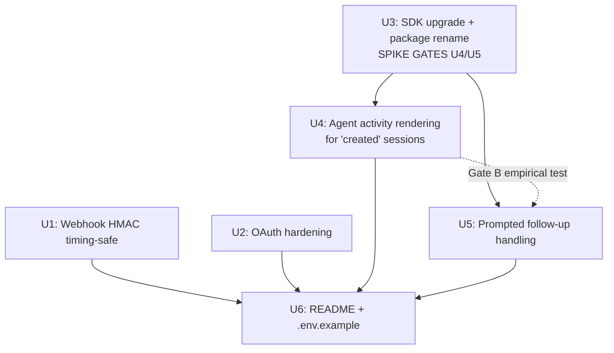

# feat: Linear Routines Bridge v1 — agent-native rendering, follow-ups, OAuth hardening

## Overview

Take the existing `claude-linear-agent` bot (280 LOC, 4 files) and turn it into a Linear-native agent that renders in the session sidebar, acknowledges within 10s, reports fire results and failures as structured activities, handles user follow-up replies by re-firing Routines with accumulated context, and is safe to publish publicly. The work is surgical edits across the existing four files plus a README and `.env.example`. Managed Agents migration, runaway protection, and persistence remain explicitly out of scope.

## Problem Frame

The current bridge posts a plain `createComment` with the Claude session URL and disappears. Linear never renders it as an agent — no sidebar, no 10s acknowledgement, no follow-up handling. The package is also named dishonestly (`claude-linear-agent` but doesn't use the Agent API), the OAuth flow has an open-redirect surface and no CSRF protection, and HMAC verification is not timing-safe. The requirements doc (see origin) resolves the scope tradeoffs: keep Routines as the backend, invest only in the Linear side plus public-release hygiene.

## Requirements Trace

- R1. `createAgentActivity` with structured `thought`/`action`/`error` types replaces `createComment` for session-bound posts → U4
- R2. Emit a `thought` activity within 10s of `action: "created"` → U4
- R3. On successful `/fire`, emit `action` activity with session URL and call `agentSessionUpdate` to set `externalUrls` → U4 (plus optional `response` close, conditional on Gate B)
- R4. On `/fire` failure, emit `error` activity with generic message; log raw error server-side → U4
- R5. Handle `action: "prompted"` webhooks: re-fire with accumulated context using nonce-tagged wrappers; author fields from trusted payload → U5 (conditional on Gate A)
- R6. Rename `claude-linear-agent` → `linear-routines-bridge` across `package.json`, README, server logs, health check → U3
- R7. Upgrade `@linear/sdk` from `^39.0.0` to `^82.0.0` → U3 (spike gates this)
- R8. README covers architecture, setup, env vars, deploy, plus four limitation callouts → U6
- R9. Timing-safe hex comparison in `verifyWebhookSignature` → U1
- R10. OAuth CSRF state + reject-on-existing-token + `BASE_URL`-derived `redirect_uri` with startup validation → U2
- R11. Don't echo raw token-exchange error bodies → U2
- R12. Remove dead `tokens` Map → U2

## Scope Boundaries

- Not migrating to Claude Managed Agents. Routines stays the backend; completion sync, status polling, SSE, cancel stay unavailable (see origin Key Decisions).
- Not emitting a heartbeat `thought` during the silent window after fire.
- Not implementing cooldown, debouncing, cost caps, or confirmation for Routine fires. Chatty threads grow quadratically and hit the 65k `text` cap silently; documented only.
- No completion callback from Claude → Linear. MCP-callback workaround explicitly rejected.
- No persistence. OAuth tokens and CSRF state in-memory only. Multi-workspace out.
- Not using `elicitation` activity type. Not displaying `agentSessionUpdate.plan` items. Not implementing cancel.
- No test framework or test files are added in v1. Verification is manual per unit (see §Key Technical Decisions).
- The R5 fallback (payload lacks thread history) keeps R5 in v1 as an error-activity responder, not as deferred-to-v1.1. See Gate A below.

## Context & Research

### Relevant Code and Patterns

- `src/webhook.ts:10-17` — `verifyWebhookSignature` uses `===` on hex strings. Target of R9.
- `src/webhook.ts:68-111` — `processNewSession` is where `createComment` lives and where `createAgentActivity`/`agentSessionUpdate` replace it. Target of R4 (failure path ~line 88-95) and R3 (success path ~line 101-107).
- `src/webhook.ts:44-56` — only handles `action: "created"`. R5 adds an `action: "prompted"` branch here.
- `src/oauth.ts:8` — dead `tokens` Map. Target of R12.
- `src/oauth.ts:11` — `currentToken` singleton stays; reject-on-existing-token hangs off this.
- `src/oauth.ts:32, 63` — `redirectUri` constructed via `getBaseUrl(c)`. Target of R10's header-derivation fix.
- `src/oauth.ts:78-82` — raw error body echoed to HTTP response. Target of R11.
- `src/oauth.ts:96-99` — `client.organization` lookup. Must still work under `@linear/sdk@^82`; the spike verifies.
- `src/oauth.ts:120-124` — `getBaseUrl` reads `host` and `x-forwarded-proto` headers. Target of R10. Replaces with validated `BASE_URL` env.
- `src/index.ts:10-16` — health-check JSON. Target of R6's rename.
- `src/index.ts:26-32` — server bootstrap. Adds `BASE_URL` validation at startup.
- `src/claude.ts` — unchanged structurally in v1.

### Institutional Learnings

- None available (no `docs/solutions/` entries in this repo). Fresh public-release project.

### External References

- Linear Agent Interaction API is GA as of March 2026 (per origin doc Dependencies/Assumptions). Planning trusts the origin doc's claim that `createAgentActivity`, `agentSessionUpdate`, and `AgentSessionEvent` with `action: "prompted"` exist; the Gate A spike is the authoritative source of truth for the v82 SDK shape.
- Claude Routines `/fire` `{text}` contract under `experimental-cc-routine-2026-04-01` beta header is the current production shape; already implemented in `src/claude.ts`.

## Key Technical Decisions

- **Spike the SDK upgrade first.** Before any R1–R5 code changes, run the upgrade and `tsc --noEmit` to validate `createAgentActivity`, `agentSessionUpdate`, and `client.organization` shapes. The 18-month jump from v39 → v82 could shift ESM/CJS exports, the `LinearClient` constructor, or the `organization` accessor. The origin doc explicitly flags this as the first implementation action.
- **R5 uses nonce-tagged wrappers, not HTML-encoding.** Per-request random tag (`<user_reply_<8-hex-chars> author="…" at="…">…</user_reply_<8-hex-chars>>`) means a reply body containing a literal closing tag cannot match the actual closing tag. Zero content mangling (better for debugging the Routines `text` payload). Cost is one `crypto.randomBytes(4).toString("hex")` call per fire. Selected over HTML-encoding because Routines `text` is consumed by Claude the model, not rendered; encoding would add round-trip confusion for anyone inspecting logs.
- **Emit a `thought` activity when context is trimmed.** When accumulated context exceeds ~64k chars and older replies are dropped, post a short `thought` ("Older replies dropped to fit context limit; the original issue and most recent replies are preserved") before firing. Doesn't break callout-2 (no runaway protection) — this is transparency, not a protection. Keeps the user out of "why is Claude ignoring my early context?" confusion.
- **No test framework in v1.** Repo has no existing tests, no test scripts in `package.json`. Adding vitest + config + ~4 test files is ~30min overhead the requirements doc does not ask for. Verification is manual per unit — curl commands, real Linear workspace walkthrough, `tsc --noEmit`. Unit tests for `verifyWebhookSignature` (pure function, security-critical) are the only ones worth adding; they are listed as a v1.1 candidate under §Documentation / Operational Notes.
- **Startup validation for `BASE_URL` is hard-fail.** If `BASE_URL` is missing, not absolute, or HTTP outside localhost, the server throws and exits before `serve()` starts. Any other behavior leaves the open-redirect surface live during misconfiguration.
- **Session state handling for R3 is conditional on Gate B.** If Linear allows `prompted` on `complete`-state sessions, R3 closes each fire with a `response` activity (cleanest). If not, sessions stay `active` and R3 stops at `action` (preserves follow-ups). Plan specifies both; Gate B picks.

## Open Questions

### Resolved During Planning

- **R5 injection safety mechanism (origin Deferred question):** nonce-tagged wrappers (see Key Technical Decisions).
- **R5 trim-event visibility (origin Deferred question):** yes, emit a `thought` activity on trim.
- **Accumulated-context assembly (origin Deferred question):** original issue body first, then replies oldest-first, each wrapped in `<user_reply_<nonce> author="…" at="…">…</user_reply_<nonce>>`. If total exceeds 64k chars (safety margin under the 65k cap), drop oldest replies first while preserving the issue body and emit the trim-notice thought.
- **Test framework decision:** no test framework in v1 (see Key Technical Decisions).

### Deferred to Implementation

- **Gate A (origin Resolve-Before-Planning):** does the `prompted` webhook payload carry full thread history, or must the bridge reconstruct it? U5 specifies both branches; the deployer runs a one-time inspection in a real workspace during U5 and picks the branch. Fallback if no history: R5 emits an `error` activity ("follow-ups require accumulated-context support; reassign the issue to restart") — still landing in v1 as an explicit error path rather than silence, since the `action: "prompted"` handler must exist or Linear will flag the session as unresponsive.
- **Gate B (origin Deferred question 2):** does Linear allow `prompted` events on a `complete`-state session? U4 specifies both branches. The deployer runs the test during U4 and picks.
- **Exact v82 method signatures:** the spike in U3 produces the authoritative shapes; the plan uses the names from the origin doc. If the spike surfaces a rename (e.g., `createAgentActivity` is namespaced under `client.agentActivities.create`), U3 records the actual shape as a "Patterns to follow" note the downstream units pick up.
- **`createAgentActivity` argument shape for the initial `thought`:** the origin doc assumes a `{ sessionId, content: { type: "thought", body: "…" } }` style. Confirmed shape comes from the spike; U4 uses whatever the TypeScript definitions require.
- **Linear SDK payload type for `AgentSessionEvent`:** exact TypeScript shape of `prompted` payload (session ID, reply text, author, timestamp, optional thread-history field) comes from the spike + Gate A. Until then, U5 treats it as an untyped `Record<string, unknown>` with runtime shape-checks at the webhook boundary.

## High-Level Technical Design

> *This illustrates the intended approach and is directional guidance for review, not implementation specification. The implementing agent should treat it as context, not code to reproduce.*

**Unit dependency graph**



U1, U2, U3 are independent and can be done in any order or in parallel. U4 and U5 both require U3's SDK-spike output. U6 is last because it documents the observed behavior.

**Webhook dispatch after U4 + U5**

```mermaid
sequenceDiagram
    participant Linear
    participant Bridge as handleWebhook
    participant Linear_SDK as Linear SDK
    participant Routines

    Linear->>Bridge: POST /webhook (AgentSessionEvent)
    Bridge->>Bridge: verify HMAC (timing-safe)
    Bridge-->>Linear: 200 OK (immediate)
    alt action == "created"
        Bridge->>Linear_SDK: createAgentActivity (thought: "Preparing…") [<10s]
        Bridge->>Routines: fire(text=issueContext)
        alt success
            Bridge->>Linear_SDK: createAgentActivity (action: "Claude session: <url>")
            Bridge->>Linear_SDK: agentSessionUpdate (externalUrls=[<url>])
            opt Gate B allows response on active
                Bridge->>Linear_SDK: createAgentActivity (response — closes session)
            end
        else failure
            Bridge->>Linear_SDK: createAgentActivity (error: "Routine fire failed — check server logs")
        end
    else action == "prompted"
        Bridge->>Linear_SDK: createAgentActivity (thought: "Preparing follow-up…") [<10s]
        alt Gate A: payload has thread history
            Bridge->>Bridge: assemble accumulated context (trim if >64k, emit trim thought)
            Bridge->>Routines: fire(text=accumulated)
            Bridge->>Linear_SDK: createAgentActivity (action/error as above)
        else Gate A: no thread history
            Bridge->>Linear_SDK: createAgentActivity (error: "follow-ups unsupported; reassign to restart")
        end
    end
```

## Implementation Units

- [x] **U1: Timing-safe HMAC webhook verification**

**Goal:** Make `verifyWebhookSignature` safe against timing-oracle attacks and malformed header input.

**Requirements:** R9

**Dependencies:** None

**Files:**
- Modify: `src/webhook.ts`

**Approach:**
- Replace the `expected === signature` compare with a `Buffer.from(hex, 'hex')` decode on both sides followed by `crypto.timingSafeEqual`.
- Length-check on decoded byte length (32 for SHA-256), not on raw hex string length.
- Return `false` without throwing when the received header contains non-hex characters (hex decode silently truncates; also validate with `/^[0-9a-f]+$/i` before decoding) or when decoded byte lengths differ (`timingSafeEqual` throws on length mismatch).
- Pattern stays synchronous, no API shape change to callers.

**Patterns to follow:**
- Standard Node `crypto.timingSafeEqual` usage; the function signature (`(payload, signature, secret) => boolean`) stays as-is.

**Test scenarios:**
- Happy path: valid signature for a known payload returns `true`.
- Happy path: signature with uppercase hex (`ABCDEF…`) still matches (hex is case-insensitive).
- Edge case: empty signature string returns `false`, does not throw.
- Edge case: signature with non-hex characters (`"zzz…"` or `"abcdefg"`) returns `false`, does not throw.
- Edge case: signature that decodes to a buffer shorter or longer than 32 bytes returns `false`, does not throw.
- Error path: tampered payload with otherwise-valid signature returns `false`.
- Verification: call `verifyWebhookSignature` from a Node REPL with hand-crafted inputs covering each scenario above; confirm no exception escapes and the return value matches expectations.

**Verification:**
- A Linear webhook with a valid signature still produces a `200 OK` in logs.
- A curl replay with a mutated byte in the body gets `401 Invalid signature`.
- A curl replay with a garbage `linear-signature: zzzzz…` header gets `401`, not `500`.

---

- [x] **U2: OAuth hardening — CSRF state, replay-reject, BASE_URL derivation, dead Map removal**

**Goal:** Close the open-redirect surface, add CSRF protection, reject workspace-swap replays, and stop leaking upstream error bodies.

**Requirements:** R10, R11, R12

**Dependencies:** None

**Files:**
- Modify: `src/oauth.ts`
- Modify: `src/index.ts` (startup `BASE_URL` validation)

**Approach:**
- Remove the dead `tokens: Map<string, string>` (R12). Keep `currentToken`.
- Add a module-scoped state store: `Map<stateToken, { createdAt: number }>` with a 10-minute TTL. On `/oauth/authorize`, generate a 32-byte random state (`crypto.randomBytes(32).toString("hex")`), store `{ createdAt: Date.now() }`, append to the authorize URL.
- On `/oauth/callback`:
  1. Reject if `currentToken !== null` (reject-on-existing-token — returns 409 with a message telling the deployer to restart to re-authorize).
  2. Read `state` from query. Reject with 400 if missing.
  3. Look up in store. Reject with 400 if missing or `Date.now() - createdAt > 10*60*1000`.
  4. Delete the entry (delete-on-read) whether or not the token exchange succeeds.
  5. Proceed with the existing token exchange.
- Replace `getBaseUrl(c)` with a module-scoped `BASE_URL` constant read once at startup. Remove the `x-forwarded-proto`/`host` fallback entirely.
- Add a validator `assertValidBaseUrl(url: string)` in `src/oauth.ts` (or a small helper `src/config.ts` if cleaner — decide during implementation; prefer inline to keep the surgical edit count low): must be set, must parse as absolute URL, must be `https://` unless host is `localhost`/`127.0.0.1`/`::1`. Throw a clear `Error` on violation.
- Call the validator from `src/index.ts` before `serve()`. If it throws, log a clear message and `process.exit(1)`.
- Replace the `return c.text(`Token exchange failed: ${err}`, 500)` with `console.error("OAuth token exchange failed:", err)` + `return c.text("Token exchange failed — check server logs", 500)` (R11).
- State store cleanup: a simple lazy-cleanup on each lookup (scan and drop expired) is sufficient for single-deployment scope. No interval timer needed.

**Patterns to follow:**
- `crypto.randomBytes(…).toString("hex")` for CSRF state (same pattern U5 uses for nonce tags).
- Hard-fail at startup pattern: the existing code already does `if (!webhookSecret) { … }`-style soft checks inside handlers; `BASE_URL` is different because misconfiguration makes the service unsafe to run at all, so it fails fast at boot.

**Test scenarios:**
- Happy path: full OAuth round-trip completes, `currentToken` gets set, `/oauth/callback` second time returns 409.
- Happy path: startup with `BASE_URL=http://localhost:3001` boots clean.
- Happy path: startup with `BASE_URL=https://routines-bridge.fly.dev` boots clean.
- Edge case: `/oauth/callback` with missing `state` query param returns 400.
- Edge case: `/oauth/callback` with `state` value not in store returns 400.
- Edge case: `/oauth/callback` with `state` older than 10 minutes returns 400, and the entry is removed from the store.
- Edge case: `/oauth/callback` called twice with the same valid `state` — second call returns 400 (delete-on-read).
- Error path: startup with no `BASE_URL` → process exits 1 with a clear error message.
- Error path: startup with `BASE_URL=ftp://…` or `BASE_URL=not-a-url` → exits 1.
- Error path: startup with `BASE_URL=http://public.example.com` (non-localhost HTTP) → exits 1.
- Error path: `/oauth/callback` with an invalid code — 500 response body is generic, full error is in server logs.
- Integration: after a successful install, an attacker-controlled `/oauth/callback?code=…&state=forged` is rejected with 409 (already-installed) before the state check even runs.

**Verification:**
- Manual OAuth walkthrough in a real Linear workspace: install succeeds on first try, second install attempt returns 409, server logs show the full upstream error text when a bad code is used but the HTTP response is generic.
- `curl http://localhost:3001/oauth/callback?code=x&state=y` returns 400.
- Start the server with `BASE_URL=http://public.example.com` — confirm it exits with exit code 1 and a clear message.

---

- [x] **U3: SDK upgrade + package rename (R7, R6) — includes the API-shape spike**

**Goal:** Move the repo off `@linear/sdk@^39` onto `^82`, rename the package to `linear-routines-bridge`, and produce a short internal note (or inline comments) documenting the actual v82 method shapes that U4 and U5 will consume.

**Requirements:** R6, R7

**Dependencies:** None (but U4 and U5 depend on this unit's spike output)

**Files:**
- Modify: `package.json` (name + `@linear/sdk` version)
- Modify: `package-lock.json` (regenerated)
- Modify: `src/index.ts` (health-check name string, console.log strings)
- Modify: `src/oauth.ts` (if v82 breaks the `client.organization` accessor pattern on `src/oauth.ts:97` — spike resolves)
- Modify: `src/webhook.ts` (only if v82 changes `createComment` signature before U4 rips it out — likely a no-op now that U4 removes `createComment` entirely)

**Approach:**
1. **Spike first.** On this branch (or a throwaway branch first if preferred), run `npm install @linear/sdk@^82.0.0`.
2. Run `npx tsc --noEmit`. Record every type error.
3. Inspect `node_modules/@linear/sdk/dist/*.d.ts` (or the installed `.d.ts` bundle) for:
   - `LinearClient` constructor — still `{ accessToken }`?
   - `client.organization` — still a property returning a Promise? Still a `.id` / `.name` shape?
   - `client.createAgentActivity` — exists? What's its argument shape? Is it namespaced (e.g., `client.agentActivities.create`)?
   - `client.agentSessionUpdate` — exists? Arg shape? Namespaced?
   - `AgentSessionEvent` — is there an exported type or does it stay `Record<string, unknown>` on the webhook boundary?
4. Fix any type errors caused purely by the version bump (e.g., renamed exports, tightened types around existing calls).
5. Record the findings as inline comments in `src/oauth.ts` near the `client.organization` call and in a short paragraph at the top of `src/webhook.ts` (or a brief top-of-file JSDoc) naming the exact v82 method paths U4/U5 will use. This avoids U4/U5 re-spiking the same ground.
6. Rename the package (R6):
   - `package.json` `"name"`: `"linear-routines-bridge"`.
   - `package.json` `"description"`: update to reflect the bridge framing.
   - `src/index.ts` health-check JSON: `name: "linear-routines-bridge"`.
   - `src/index.ts` console.log strings: replace `claude-linear-agent starting on port ${port}` with `linear-routines-bridge starting on port ${port}`.
7. Do not bump the version number here (stays 0.1.0 — v1 release bump is a separate step the deployer owns).

**Execution note:** Treat the spike as a gate. If the spike reveals that `createAgentActivity` or `agentSessionUpdate` do not exist at all (or are shaped very differently from the requirements doc's assumption), stop and raise the finding before continuing to U4/U5 — the whole R1–R5 plan shape may need revision. If the spike reveals only surface-level shape changes (rename, namespacing, added required arg), record the actual shape and continue.

**Patterns to follow:**
- Existing `import { LinearClient } from "@linear/sdk"` import style.
- Node 20+ ESM (as declared in `package.json`).

**Test scenarios:**
- Test expectation: none on the rename itself — pure string substitution.
- Spike happy path: `npm install @linear/sdk@^82 && npx tsc --noEmit` completes without errors after fixes land.
- Spike finding: inline comments / JSDoc in the code document the v82 method paths for `createAgentActivity`, `agentSessionUpdate`, and (if applicable) the organization lookup.
- Integration (post-rename): `curl http://localhost:3001/` returns `{ "name": "linear-routines-bridge", "status": "running", "version": "0.1.0" }`.
- Integration: `npm run dev` startup logs say `linear-routines-bridge starting on port …`.

**Verification:**
- `npx tsc --noEmit` is clean.
- `npm run dev` boots and the health check shows the new name.
- The spike findings are captured in the repo (comments, JSDoc, or a short paragraph — not a standalone doc) so U4/U5 do not re-discover them.

---

- [ ] **U4: Agent activity rendering for `created` sessions (R1, R2, R3, R4)**

**Goal:** Replace the `createComment` flow in `processNewSession` with the structured `thought` → `action` → optional `response` (or stay-active) sequence, plus `agentSessionUpdate` for `externalUrls`, and an `error` activity on failure. Includes running Gate B.

**Requirements:** R1, R2, R3, R4

**Dependencies:** U3 (needs v82 SDK + documented method shapes)

**Files:**
- Modify: `src/webhook.ts` (the `processNewSession` function and the surrounding dispatch)

**Approach:**
1. The HTTP 200 ack to Linear already returns immediately (existing code). Keep that.
2. In `processNewSession`:
   - Extract `sessionId` from the payload (location TBD by spike output — likely `payload.data.id` or `payload.agentSessionId`; U3's notes document it).
   - **First call, within 10s of receipt:** `client.createAgentActivity({ sessionId, content: { type: "thought", body: "Preparing to fire Claude Routine with issue context…" } })` — exact shape uses U3's documented v82 names. Await this before `/fire` so Linear sees the 10s acknowledgement even if `/fire` is slow.
   - Call `triggerRoutine(issueContext)` — no changes to `claude.ts`.
   - **On success:**
     - `client.createAgentActivity({ sessionId, content: { type: "action", body: "Claude session: <url>", … } })`.
     - `client.agentSessionUpdate({ sessionId, externalUrls: [sessionUrl] })`.
     - Run Gate B once (see below) and pick the close-with-`response` branch or stay-active branch.
   - **On failure (`!result.sessionUrl`):**
     - `console.error("Routine fire failed:", result.error)` — full error, server-side only.
     - `client.createAgentActivity({ sessionId, content: { type: "error", body: "Routine fire failed — check server logs." } })`.
     - Do NOT include `result.error` in the activity body (R4).
3. Delete the `createComment` calls on both success and failure paths.
4. If `getLinearClient()` returns `null` (OAuth not installed), log a warning and return — same as today.
5. **Gate B (run once during U4):** In the test workspace, after the `action` activity fires, manually send a `prompted` event (user replies in the Linear session thread) and observe whether Linear routes it to the webhook.
   - **If Gate B passes (Linear allows `prompted` on a session previously closed with `response`):** add a third `createAgentActivity` on the success path with `content.type: "response"` to cleanly close the session while preserving follow-ups.
   - **If Gate B fails:** stop at the `action` activity. Sessions stay `active` until Linear's stale-after-N timeout or user reassignment. Record the finding in a short inline comment in `webhook.ts` so future readers know why no `response` is emitted.

**Execution note:** The Gate B test needs the v82 SDK (U3) and at least the `thought`+`action` path landed so a real session can be produced. Order within the unit: land `thought` + fire + `action` + `agentSessionUpdate` + `error`, get a real session, run Gate B, then either add the `response` close or record the stay-active decision.

**Technical design:** see the High-Level sequence diagram for the `action == "created"` branch.

**Patterns to follow:**
- Existing `async function processNewSession` structure.
- Existing `console.error` / `console.log` logging patterns for server-side diagnostics.

**Test scenarios:**
- Happy path: assign an issue to the agent in a real workspace → within 10s a `thought` activity appears in the Linear sidebar. After `/fire` returns, an `action` activity with the Claude session URL appears. The session sidebar shows a clickable external link via `externalUrls`. No `createComment` appears in the issue thread.
- Happy path (Gate B passes): after the `action`, a `response` activity closes the session cleanly.
- Happy path (Gate B fails): after the `action`, no further activity is emitted; session stays `active`.
- Error path: force `/fire` to fail (e.g., unset `CLAUDE_ROUTINE_TOKEN` temporarily) → an `error` activity with body `"Routine fire failed — check server logs"` appears in the sidebar. Server logs contain the full `result.error` including the upstream response body.
- Error path: the `error` activity body does NOT contain the upstream API error text, status code, or request ID.
- Edge case: `getLinearClient()` returns `null` (agent not installed yet) — log a warning, do not crash, do not emit activities.
- Edge case: the `thought` activity fires before `/fire` so that even a slow Routines API does not cause Linear to flag the session as unresponsive.
- Integration: the same webhook payload does not produce both a `createAgentActivity` AND a `createComment` — the comment path is fully removed.

**Verification:**
- Manual walkthrough in a real Linear workspace as described above.
- `grep createComment src/` returns zero hits.

---

- [ ] **U5: Prompted follow-up handling (R5)**

**Goal:** Handle `AgentSessionEvent` webhooks with `action: "prompted"`. Re-fire a Claude Routine with accumulated context if the payload carries thread history; otherwise emit an explicit error activity telling the user to reassign. Includes running Gate A.

**Requirements:** R5

**Dependencies:** U3 (v82 SDK), U4 (agent-activity emission pattern established)

**Files:**
- Modify: `src/webhook.ts` (add the `action: "prompted"` branch and the context-assembly helper)

**Approach:**
1. In `handleWebhook`, extend the dispatch:
   ```
   if (payload.action === "created") { processNewSession(payload).catch(...) }
   else if (payload.action === "prompted") { processPromptedSession(payload).catch(...) }
   ```
2. **Gate A (run once during U5):** In the test workspace, trigger a `prompted` event and log the raw payload (`console.log(JSON.stringify(rawBody, null, 2))` — gated behind a dev flag so it does not run in production). Inspect the payload to determine whether it includes:
   - Just the latest reply text (and author/timestamp)?
   - The full thread history with all prior replies?
   - A `messages` / `thread` / `comments` array?
3. **If Gate A passes (full history in payload):**
   - Implement `processPromptedSession`:
     - Extract `sessionId` and the thread history from the payload.
     - Emit a `thought` activity within 10s: `"Preparing follow-up with accumulated context…"`.
     - Assemble accumulated context: original issue body first, then replies oldest-first. Each reply wrapped in `<user_reply_<nonce> author="<payload.author.name>" at="<payload.author.timestamp>">…</user_reply_<nonce>>` where `<nonce>` is `crypto.randomBytes(4).toString("hex")` — fresh per fire.
     - Author and timestamp fields come from the trusted webhook payload fields, NEVER from the reply text (R5 explicit).
     - Check total length. If `> 64000` chars (safety margin under the 65k cap), drop oldest replies first while preserving the issue body. If trimming occurred, emit a `thought` activity before firing: `"Older replies dropped to fit context limit; the original issue and most recent replies are preserved."`
     - Call `triggerRoutine(accumulatedText)`.
     - On success/failure: same `action`/`error` + `agentSessionUpdate` sequence U4 established.
4. **If Gate A fails (no thread history in payload):**
   - Implement `processPromptedSession` as the explicit error path:
     - Emit a `thought` within 10s so Linear doesn't flag the session: `"Follow-up received — processing…"`.
     - Emit an `error` activity: `"Follow-ups require accumulated-context support; please reassign the issue to restart."`
     - Do not call Routines. Do not accumulate state in memory (origin scope boundary).
   - Record the Gate A finding in an inline code comment so future readers know why the handler is a dead-end.
5. Do NOT introduce an in-memory `sessions` Map. Origin doc explicitly scopes this out. If Gate A fails AND a future v1.1 wants real follow-ups, that requires a scope expansion to add persistence.

**Execution note:** The nonce wrapper is per-fire, not per-reply — a single fresh nonce is used for all replies within one context assembly. A reply body attempting to inject a closing tag cannot guess the nonce.

**Technical design:** see the High-Level sequence diagram for the `action == "prompted"` branch.

**Patterns to follow:**
- `processNewSession` structure from U4 (shared shape: `thought` → fire → `action`/`error`).
- `crypto.randomBytes(…).toString("hex")` pattern (same as U2's CSRF state).

**Test scenarios:**
- Gate A probe: a single manual `prompted` event in the test workspace with dev-logging on produces a payload that either does or does not contain thread history. Record which and commit accordingly.
- Happy path (Gate A passes): a user replies in the Linear session thread → within 10s a `thought` activity appears. The follow-up fire produces a new `action` activity with the new Claude session URL. The Routines `text` payload contains the original issue body plus all replies wrapped in `<user_reply_<nonce>>` tags.
- Happy path (Gate A passes): the author/timestamp in the wrapper tags match the webhook payload, not any content from the reply body itself.
- Edge case (Gate A passes): a reply containing the literal string `</user_reply_deadbeef>` does NOT escape the wrapper because the real nonce is a fresh random value for this fire.
- Edge case (Gate A passes): accumulated context exceeds 64k chars → oldest replies dropped, issue body preserved, a trim-notice `thought` activity fires before the Routine fire, and the Routines text length is under 64k.
- Error path (Gate A passes): Routine fire fails → `error` activity emitted, raw error logged server-side only.
- Edge case (Gate A fails): every `prompted` event receives an `error` activity telling the user to reassign; no Routine fire occurs.
- Integration: a `prompted` payload received while the agent is not installed (`getLinearClient()` returns null) — log warning, do not crash, no activities emitted.

**Verification:**
- Gate A outcome is documented in code (inline comment in `src/webhook.ts`).
- Manual walkthrough: reply in a Linear session thread, observe the sidebar behavior matches the documented Gate A branch.
- `grep -n "user_reply_" src/webhook.ts` shows the nonce suffix pattern is used (not a fixed tag).

---

- [ ] **U6: README + `.env.example` + four limitation callouts (R8)**

**Goal:** Public-release documentation: architecture overview, setup (Linear OAuth app + webhook + Claude Routine config), required env vars (including `BASE_URL`), deploy options, and the four prominent limitation callouts the origin doc mandates.

**Requirements:** R8

**Dependencies:** U1, U2, U3, U4, U5 (README describes observed behavior; Gate A and Gate B outcomes affect which branch is documented)

**Files:**
- Create: `README.md`
- Create: `.env.example`

**Approach:**
1. `README.md` sections:
   - **What it is:** one-paragraph bridge framing (Linear agent → Routines fire-and-forget).
   - **Architecture:** small ASCII or mermaid diagram of webhook → `processNewSession`/`processPromptedSession` → Routines `/fire`. Reuse the High-Level Technical Design sequence diagram from this plan, simplified.
   - **Setup:**
     - Register a Linear OAuth app (scopes: `read`, `write`, `app:assignable`; actor `app`; redirect URI `<BASE_URL>/oauth/callback`).
     - Configure a Linear webhook with `AgentSessionEvent` subscription pointing at `<BASE_URL>/webhook`.
     - Create a Claude Routine at `claude.ai/code/routines` with target repo and prompt template.
     - Install: `npm install`, then set env vars, then `npm run dev` or `npm run build && npm start`.
     - Visit `<BASE_URL>/oauth/authorize` once to install.
   - **Required env vars:**
     - `LINEAR_CLIENT_ID`, `LINEAR_CLIENT_SECRET`, `LINEAR_WEBHOOK_SECRET`
     - `CLAUDE_ROUTINE_ID`, `CLAUDE_ROUTINE_TOKEN`
     - `BASE_URL` (absolute URL; non-localhost must be `https://`)
     - `PORT` (optional, default 3001)
   - **Deploy options:**
     - Local with a tunnel (note: rotating tunnel URL requires updating both `BASE_URL` and the Linear OAuth app's registered redirect URI).
     - Fly / Railway / Render-class PaaS (set env vars in the platform; `BASE_URL` is the public https URL).
   - **Four limitation callouts** (these are mandatory per R8 — reproduce verbatim from origin):
     1. **No completion signal** — after the action activity, the Linear sidebar goes silent. Users must click to `claude.ai/code` for live progress. Inherent to Routines.
     2. **No cost or runaway protection** — every reply fires a new Routine with accumulated context. Chatty threads grow quadratically and hit the 65k-char `text` cap around 15–25 replies, at which point older context is silently truncated.
     3. **Tokens lost on restart** — OAuth tokens and CSRF state live in-memory only. Every server restart requires re-authorization. Not suitable for free-tier PaaS that sleeps idle containers without manual re-install. For local dev with tunnels: if the tunnel URL rotates, both `BASE_URL` and the Linear OAuth app's registered `redirect_uri` must be updated.
     4. **Webhook secret = Routines fire credential** — a leaked `LINEAR_WEBHOOK_SECRET` lets any party forge Linear events that pass HMAC verification and trigger Routines fires with arbitrary `text` against the deployer's Anthropic account — functionally equivalent to leaking `CLAUDE_ROUTINE_TOKEN`. Treat both secrets with the same care; rotate the webhook secret in Linear's app settings and the env var together.
   - **License & contributing:** one-line placeholders (deployer decides).
2. `.env.example`:
   - All required env vars listed with inline one-line comments explaining purpose and example format.
   - `BASE_URL` gets an explicit comment: absolute URL, non-localhost must be `https://`, startup fails fast otherwise.
3. Keep README concise — this is a pre-release repo, not a long-established project. Avoid aspirational sections (roadmap, contribution guidelines) that outpace the current scope.

**Patterns to follow:**
- Standard Node/TypeScript README conventions: ordered top-down (what → why → setup → env → deploy → limitations).
- Limitation callouts styled as GitHub-flavored markdown admonitions (`> **Warning:**` or `> [!WARNING]`) so they are visually prominent.

**Test scenarios:**
- Test expectation: none — pure documentation. Verification is editorial.
- Verification: a fresh reader can, from the README alone, register a Linear OAuth app, configure a webhook, create a Claude Routine, set the right env vars, start the server, install the agent, and assign an issue to see an agent activity in the Linear sidebar.
- Verification: each of the four limitation callouts is visually prominent (not buried in a paragraph).
- Verification: `BASE_URL` is documented with its validation rules and with the tunnel-rotation caveat.
- Verification: running `cp .env.example .env` and filling in values produces a working server (after the OAuth visit).

**Verification:**
- Manual read-through by the deployer (or a second reviewer).
- A clean-machine dry run from the README: `git clone`, `npm install`, fill `.env`, `npm run dev`, visit `/oauth/authorize`, assign a test issue — full loop works.

---

## System-Wide Impact

- **Interaction graph:** The webhook handler is the only entry point; all unit changes flow through `handleWebhook` and its two async processors (`processNewSession`, `processPromptedSession`). The OAuth handlers are independent. No middleware, no background jobs, no callbacks outside these three handlers.
- **Error propagation:** Today, `processNewSession` swallows errors in the `.catch()` on line 51 of `webhook.ts`. Keep that top-level `.catch` (Linear already got its 200) but add `console.error` inside processor functions for specific failure points (Linear SDK call fails, Routines fire fails, Gate-A-fallback case). All user-facing failure paths become structured `error` activities; no plain-text comments, no silent drops.
- **State lifecycle risks:** OAuth `currentToken` and the new state store both live in a single Node process. A cold-start / crash / restart loses both (documented as R8 callout 3). The reject-on-existing-token policy (R10) means a second install attempt cleanly 409s rather than overwriting — deployer must restart to re-authorize a different workspace. No partial-write risk because state-delete-on-read is atomic within a single event loop tick.
- **API surface parity:** No public API surface exists outside the three HTTP endpoints (`/`, `/oauth/*`, `/webhook`). The health check shape changes (`name` field) — minor compat implication if anyone's monitoring scrapes it by name. The webhook response contract (text `OK`, 200 ack) is unchanged.
- **Integration coverage:** Gate A and Gate B are the two integration points where mock-only verification is insufficient. Both require a real Linear workspace to resolve. Budget 15–30 minutes of wall-clock time during U4 and U5 to run them.
- **Unchanged invariants:**
  - `src/claude.ts` stays byte-for-byte identical. The Routines `/fire` contract, the `{text}` payload shape, the beta header, and the response-parsing logic all stay.
  - The `verifyWebhookSignature` function signature `(payload, signature, secret) => boolean` stays — only the internal implementation changes.
  - `getLinearClient(): LinearClient | null` contract stays.
  - `handleWebhook` return values (200/401/500 text responses) stay.
  - The dispatch rule "respond 200 immediately, process async" stays.

## Risks & Dependencies

| Risk | Mitigation |
|------|------------|
| `@linear/sdk@^82` does not expose `createAgentActivity` or `agentSessionUpdate` in the shape the requirements doc assumes | U3's spike is explicitly a gate. If the spike surfaces a fundamental shape mismatch (not just a rename), stop and raise the finding before U4/U5. The R1–R5 plan shape may need revision — acceptable outcome; the spike exists to catch this. |
| Gate A fails: `prompted` payload does not carry thread history | Explicit fallback — U5 implements the error-activity path. Still lands R5 in v1 as a handler that keeps Linear from flagging the session, just not with real follow-ups. Future v1.1 can add persistence scope if adoption signal warrants. |
| Gate B fails: Linear does not allow `prompted` on `complete`-state sessions | Explicit fallback — U4 stops at the `action` activity. Sessions stay `active`; follow-ups still work. Documented via inline comment. |
| v39 → v82 SDK jump breaks `client.organization` or `LinearClient` constructor | U3 spike + `tsc --noEmit` catches this at implementation time. If `client.organization` is renamed, U3 updates `src/oauth.ts:97` accordingly. |
| `BASE_URL` startup hard-fail breaks deployers who rely on the current header-derived behavior | Documented breaking change in README. Migration is one env var. Benefit (closed open-redirect surface) outweighs the one-time setup cost. |
| Nonce wrapper approach leaks a static pattern that an attacker can scan for | Attacker needs the exact nonce, which is `crypto.randomBytes(4)` (32 bits, per-fire). Finding a matching counterfeit closing tag in the reply body requires 2^32 tries against a body Linear already size-caps. Acceptable for v1. If needed later, bump to 8-byte random (64 bits). |
| Trim-notice `thought` doubles as an unwanted cost-protection hint, raising expectations we haven't met | Phrase the notice as pure transparency ("Older replies dropped to fit context limit…"), not as a cap or limit. Matches R8 callout 2's "no runaway protection in code" framing. |
| No test suite means regressions slip through | Verification scenarios per unit are runnable by hand; OAuth and webhook paths have clear curl/workspace walkthroughs. Unit tests for `verifyWebhookSignature` are the highest-value addition if anyone wants to invest — flagged as v1.1 candidate. |

## Documentation / Operational Notes

- **README + `.env.example` are part of v1 scope (U6).** Not optional.
- **Gate A and Gate B outcomes get recorded as inline code comments**, not as separate docs — the origin doc is the spec, the code is the evidence.
- **U3's spike findings get recorded in code** (inline comments in `src/oauth.ts` near `client.organization`, and at the top of `src/webhook.ts` naming the v82 method paths). No separate spike document.
- **Rollout:** single-deployer, single-workspace, no migration concerns. First install is a fresh OAuth visit after `npm run dev`. No staged rollout needed.
- **Monitoring:** none in v1. `console.log` / `console.error` are the only observability surface; deployers should tail their PaaS logs.
- **v1.1 candidates (not v1 scope):**
  - Unit tests for `verifyWebhookSignature` and the accumulated-context assembly helper (vitest or node:test — whichever has lighter overhead).
  - Heartbeat `thought` activity during the silent window after fire.
  - Token persistence (SQLite or env-driven) to survive restarts.
  - Cost/runaway protection for chatty threads.
  - Managed Agents migration to close the completion loop.

## Sources & References

- **Origin document:** [docs/brainstorms/linear-routines-bridge-requirements.md](../brainstorms/linear-routines-bridge-requirements.md)
- Related code:
  - `src/webhook.ts` (verifyWebhookSignature, processNewSession)
  - `src/oauth.ts` (handleAuthorize, handleCallback, getLinearClient, getBaseUrl)
  - `src/index.ts` (health check, server bootstrap)
  - `src/claude.ts` (Routines `/fire` — unchanged in v1)
  - `package.json` (name + `@linear/sdk` version)
- External docs: Linear Agent Interaction API (authoritative shape resolved by U3's spike, not by a pre-planning lookup).
